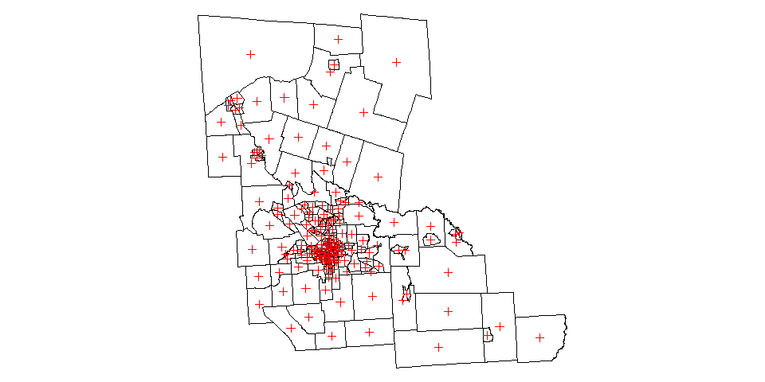

# Read GeoJson Example


# Load Data


```r
file.url <- "https://raw.githubusercontent.com/lecy/analyzing-nonprofit-service-areas/master/SHAPEFILES/syr_merged.geojson"

syr <- geojson_read( file.url, method="local", what="sp")

file.url <- "https://raw.githubusercontent.com/lecy/analyzing-nonprofit-service-areas/master/SHAPEFILES/syr_merged_cen.geojson"

centroids <- geojson_read( file.url, method="local", what="sp")

par( mar=c(0,0,0,0) )  # drop plot margins
plot( syr )
plot( centroids, col="red", add=T )
```

<!-- -->

```r
names( syr )
```

```
##  [1] "STATEFP10.1"  "COUNTYFP10.1" "TRACTCE10.1"  "GEOID10.1"   
##  [5] "NAME10.1"     "NAMELSAD10.1" "MTFCC10.1"    "FUNCSTAT10.1"
##  [9] "ALAND10.1"    "AWATER10.1"   "INTPTLAT10.1" "INTPTLON10.1"
## [13] "STATEFP10.2"  "COUNTYFP10.2" "TRACTCE10.2"  "GEOID10.2"   
## [17] "NAME10.2"     "NAMELSAD10.2" "MTFCC10.2"    "FUNCSTAT10.2"
## [21] "ALAND10.2"    "AWATER10.2"   "INTPTLAT10.2" "INTPTLON10.2"
## [25] "STATEFP10"    "COUNTYFP10"   "TRACTCE10"    "GEOID10"     
## [29] "NAME10"       "NAMELSAD10"   "MTFCC10"      "FUNCSTAT10"  
## [33] "ALAND10"      "AWATER10"     "INTPTLAT10"   "INTPTLON10"  
## [37] "NAME"         "GEOID"        "state"        "county"      
## [41] "tract"        "mdn_hous_val" "tenure_tot"   "tenure_own"  
## [45] "tenure_rent"  "tot_occup"    "occupied"     "vacant"      
## [49] "tot_pop"      "tot_race"     "white"        "black"       
## [53] "am_ind"       "asian"        "islander"     "other"       
## [57] "mixed"        "not_hispanic" "hispanic"     "porp_white"
```


