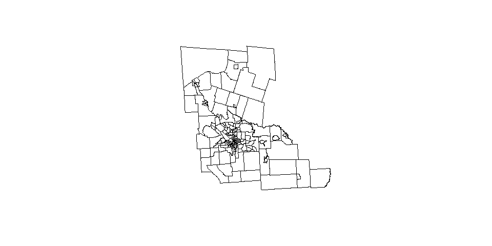
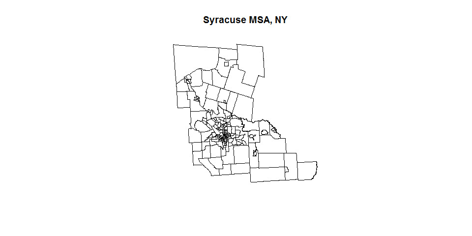
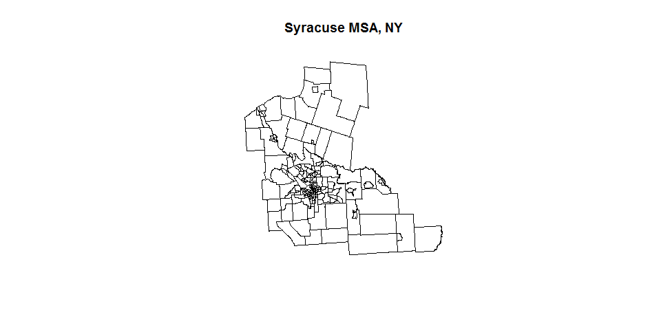

# Step 2 - Shapefiles to Geojson Files
Matt McKnight  
June 13, 2017  

# SHAPEFILES TO GEOJSON FILES

Geojson files are useful to use in analysis because they combine all the files necessary for spatial data into one file. Simple yet versatile. Step 2 will show how US census data for this project was downloaded, merged, and converted into geojson files.


# DOWNLOAD SHAPEFILES 

Begin by using functions from the tigris package to directly download selected census tract shapefiles. Using this package only requires using a function to download shapefiles into R, making it very simple to use.


```r
# How to download shapefiles from the census directly using tigris functions
# https://rdrr.io/cran/tigris/man/blocks.html

Mad_county <- tracts(state = "NY", county = "053", year = "2015")

On_county <- tracts(state = "NY", county = "067", year = "2015")

Osw_county <- tracts(state = "NY", county = "075", year = "2015")

# Drop NAs
Mad_county <- na.omit(Mad_county)
On_county <- na.omit(On_county)
Osw_county <- na.omit(Osw_county)
```

# MERGE DATA

Add Syracuse MSA census tract data to census tract shape files


```r
# Read in census data

source_data("https://github.com/lecy/analyzing-nonprofit-service-areas/blob/master/ASSETS/acs_2015_syr.Rda?raw=true")
```

```
## [1] "acs_2015_syr"
```

## Clean census data GEOID

The data downloaded from the census API includes values in GEOID cells that need to be removed prior to merging with shapefiles.


```r
head(acs_2015_syr$GEOID)
```

```
## [1] "14000US36053030101" "14000US36053030102" "14000US36053030103"
## [4] "14000US36053030200" "14000US36053030300" "14000US36053030401"
```

```r
acs_2015_syr$GEOID <- gsub(acs_2015_syr$GEOID, pattern="14000US", replacement="")
census_dat <- acs_2015_syr

head(acs_2015_syr$GEOID)
```

```
## [1] "36053030101" "36053030102" "36053030103" "36053030200" "36053030300"
## [6] "36053030401"
```

## Merge 3 spatial files

When the shapefiles are joined, they do not create a full list variable of all GEOIDs. This step creates one GEOID variabe combined from all three shapefiles.


```r
# Spatial join
syr_msa <- union(Mad_county, On_county)
syr_msa <- union(syr_msa, Osw_county)

# Create complete 

GEOID <- data.frame(syr_msa$GEOID.1, syr_msa$GEOID.2, syr_msa$GEOID)
head(GEOID)
```

<div data-pagedtable="false">
  <script data-pagedtable-source type="application/json">
{"columns":[{"label":["syr_msa.GEOID.1"],"name":[1],"type":["fctr"],"align":["left"]},{"label":["syr_msa.GEOID.2"],"name":[2],"type":["fctr"],"align":["left"]},{"label":["syr_msa.GEOID"],"name":[3],"type":["fctr"],"align":["left"]}],"data":[{"1":"36053030101","2":"NA","3":"NA"},{"1":"36053030200","2":"NA","3":"NA"},{"1":"36053030103","2":"NA","3":"NA"},{"1":"36053030102","2":"NA","3":"NA"},{"1":"36053031000","2":"NA","3":"NA"},{"1":"36053031100","2":"NA","3":"NA"}],"options":{"columns":{"min":{},"max":[10]},"rows":{"min":[10],"max":[10]},"pages":{}}}
  </script>
</div>

```r
GEOID_tot <- GEOID[!is.na(GEOID)]
GEOID$GEOID_tot <- GEOID_tot
head(GEOID)
```

<div data-pagedtable="false">
  <script data-pagedtable-source type="application/json">
{"columns":[{"label":["syr_msa.GEOID.1"],"name":[1],"type":["fctr"],"align":["left"]},{"label":["syr_msa.GEOID.2"],"name":[2],"type":["fctr"],"align":["left"]},{"label":["syr_msa.GEOID"],"name":[3],"type":["fctr"],"align":["left"]},{"label":["GEOID_tot"],"name":[4],"type":["chr"],"align":["left"]}],"data":[{"1":"36053030101","2":"NA","3":"NA","4":"36053030101"},{"1":"36053030200","2":"NA","3":"NA","4":"36053030200"},{"1":"36053030103","2":"NA","3":"NA","4":"36053030103"},{"1":"36053030102","2":"NA","3":"NA","4":"36053030102"},{"1":"36053031000","2":"NA","3":"NA","4":"36053031000"},{"1":"36053031100","2":"NA","3":"NA","4":"36053031100"}],"options":{"columns":{"min":{},"max":[10]},"rows":{"min":[10],"max":[10]},"pages":{}}}
  </script>
</div>

```r
syr_msa$GEOID_full <- GEOID_tot

# syr_msa <- cbind( Mad_county, On_county )
# syr_msa <- cbind( syr_msa, Osw_county )
# Does not work, Error: arguments imply differing number of rows: 16, 140

plot(syr_msa)
```

<!-- -->

## Merge census attribute data with shapefile data

Merge Syracuse MSA data from [Step 1](Step_1_-_Download_and_Clean_Data.html). Occasionally, some census tract may need to be dropped because they only cover bodies of water with no other census information. In this MSA, one body of water census tract is deleted from the data. 


```r
# Merge data with MSA shp file

syr_merged <- merge(syr_msa, census_dat, 
                    by.x = "GEOID_full", by.y = "GEOID")                      

plot(syr_merged)
title(main = "Syracuse MSA, NY")
```

<!-- -->

```r
head(syr_merged)
```

<div data-pagedtable="false">
  <script data-pagedtable-source type="application/json">
{"columns":[{"label":["GEOID_full"],"name":[1],"type":["chr"],"align":["left"]},{"label":["STATEFP.1"],"name":[2],"type":["chr"],"align":["left"]},{"label":["COUNTYFP.1"],"name":[3],"type":["chr"],"align":["left"]},{"label":["TRACTCE.1"],"name":[4],"type":["chr"],"align":["left"]},{"label":["GEOID.1"],"name":[5],"type":["chr"],"align":["left"]},{"label":["NAME.1"],"name":[6],"type":["chr"],"align":["left"]},{"label":["NAMELSAD.1"],"name":[7],"type":["chr"],"align":["left"]},{"label":["MTFCC.1"],"name":[8],"type":["chr"],"align":["left"]},{"label":["FUNCSTAT.1"],"name":[9],"type":["chr"],"align":["left"]},{"label":["ALAND.1"],"name":[10],"type":["chr"],"align":["left"]},{"label":["AWATER.1"],"name":[11],"type":["chr"],"align":["left"]},{"label":["INTPTLAT.1"],"name":[12],"type":["chr"],"align":["left"]},{"label":["INTPTLON.1"],"name":[13],"type":["chr"],"align":["left"]},{"label":["STATEFP.2"],"name":[14],"type":["chr"],"align":["left"]},{"label":["COUNTYFP.2"],"name":[15],"type":["chr"],"align":["left"]},{"label":["TRACTCE.2"],"name":[16],"type":["chr"],"align":["left"]},{"label":["GEOID.2"],"name":[17],"type":["chr"],"align":["left"]},{"label":["NAME.2"],"name":[18],"type":["chr"],"align":["left"]},{"label":["NAMELSAD.2"],"name":[19],"type":["chr"],"align":["left"]},{"label":["MTFCC.2"],"name":[20],"type":["chr"],"align":["left"]},{"label":["FUNCSTAT.2"],"name":[21],"type":["chr"],"align":["left"]},{"label":["ALAND.2"],"name":[22],"type":["chr"],"align":["left"]},{"label":["AWATER.2"],"name":[23],"type":["chr"],"align":["left"]},{"label":["INTPTLAT.2"],"name":[24],"type":["chr"],"align":["left"]},{"label":["INTPTLON.2"],"name":[25],"type":["chr"],"align":["left"]},{"label":["STATEFP"],"name":[26],"type":["chr"],"align":["left"]},{"label":["COUNTYFP"],"name":[27],"type":["chr"],"align":["left"]},{"label":["TRACTCE"],"name":[28],"type":["chr"],"align":["left"]},{"label":["GEOID"],"name":[29],"type":["chr"],"align":["left"]},{"label":["NAME.x"],"name":[30],"type":["chr"],"align":["left"]},{"label":["NAMELSAD"],"name":[31],"type":["chr"],"align":["left"]},{"label":["MTFCC"],"name":[32],"type":["chr"],"align":["left"]},{"label":["FUNCSTAT"],"name":[33],"type":["chr"],"align":["left"]},{"label":["ALAND"],"name":[34],"type":["chr"],"align":["left"]},{"label":["AWATER"],"name":[35],"type":["chr"],"align":["left"]},{"label":["INTPTLAT"],"name":[36],"type":["chr"],"align":["left"]},{"label":["INTPTLON"],"name":[37],"type":["chr"],"align":["left"]},{"label":["NAME.y"],"name":[38],"type":["chr"],"align":["left"]},{"label":["state"],"name":[39],"type":["chr"],"align":["left"]},{"label":["county"],"name":[40],"type":["chr"],"align":["left"]},{"label":["tract"],"name":[41],"type":["chr"],"align":["left"]},{"label":["mdn_hous_val"],"name":[42],"type":["dbl"],"align":["right"]},{"label":["tenure_tot"],"name":[43],"type":["dbl"],"align":["right"]},{"label":["tenure_own"],"name":[44],"type":["dbl"],"align":["right"]},{"label":["tenure_rent"],"name":[45],"type":["dbl"],"align":["right"]},{"label":["tot_occup"],"name":[46],"type":["dbl"],"align":["right"]},{"label":["occupied"],"name":[47],"type":["dbl"],"align":["right"]},{"label":["vacant"],"name":[48],"type":["dbl"],"align":["right"]},{"label":["tot_pop"],"name":[49],"type":["dbl"],"align":["right"]},{"label":["mhh_income"],"name":[50],"type":["dbl"],"align":["right"]},{"label":["poverty"],"name":[51],"type":["dbl"],"align":["right"]},{"label":["labor_part"],"name":[52],"type":["dbl"],"align":["right"]},{"label":["unemploy"],"name":[53],"type":["dbl"],"align":["right"]},{"label":["high_sch"],"name":[54],"type":["dbl"],"align":["right"]},{"label":["ged"],"name":[55],"type":["dbl"],"align":["right"]},{"label":["tot_race"],"name":[56],"type":["dbl"],"align":["right"]},{"label":["white"],"name":[57],"type":["dbl"],"align":["right"]},{"label":["black"],"name":[58],"type":["dbl"],"align":["right"]},{"label":["am_ind"],"name":[59],"type":["dbl"],"align":["right"]},{"label":["asian"],"name":[60],"type":["dbl"],"align":["right"]},{"label":["islander"],"name":[61],"type":["dbl"],"align":["right"]},{"label":["other"],"name":[62],"type":["dbl"],"align":["right"]},{"label":["mixed"],"name":[63],"type":["dbl"],"align":["right"]},{"label":["not_hispanic"],"name":[64],"type":["dbl"],"align":["right"]},{"label":["hispanic"],"name":[65],"type":["dbl"],"align":["right"]},{"label":["prop_white"],"name":[66],"type":["dbl"],"align":["right"]},{"label":["prop_m"],"name":[67],"type":["dbl"],"align":["right"]},{"label":["prop_black"],"name":[68],"type":["dbl"],"align":["right"]},{"label":["prop_hisp"],"name":[69],"type":["dbl"],"align":["right"]},{"label":["pov"],"name":[70],"type":["dbl"],"align":["right"]},{"label":["unemp"],"name":[71],"type":["dbl"],"align":["right"]},{"label":["educ"],"name":[72],"type":["dbl"],"align":["right"]},{"label":["prop_rent"],"name":[73],"type":["dbl"],"align":["right"]}],"data":[{"1":"36053030101","2":"36","3":"053","4":"030101","5":"36053030101","6":"301.01","7":"Census Tract 301.01","8":"G5020","9":"S","10":"2775435","11":"0","12":"+43.0982901","13":"-075.6497099","14":"NA","15":"NA","16":"NA","17":"NA","18":"NA","19":"NA","20":"NA","21":"NA","22":"NA","23":"NA","24":"NA","25":"NA","26":"NA","27":"NA","28":"NA","29":"NA","30":"NA","31":"NA","32":"NA","33":"NA","34":"NA","35":"NA","36":"NA","37":"NA","38":"Census Tract 301.01, Madison County, New York","39":"36","40":"053","41":"030101","42":"81100","43":"982","44":"419","45":"563","46":"1206","47":"982","48":"224","49":"2759","50":"42813","51":"792","52":"1991","53":"147","54":"439","55":"182","56":"2759","57":"2499","58":"77","59":"63","60":"16","61":"0","62":"0","63":"4","64":"2659","65":"100","66":"0.9057630","67":"0.094237042","68":"0.027908663","69":"0.03624502","70":"0.28706053","71":"0.05328017","72":"0.2250816","73":"0.4668325"},{"1":"36053030200","2":"36","3":"053","4":"030200","5":"36053030200","6":"302","7":"Census Tract 302","8":"G5020","9":"S","10":"79435467","11":"46792","12":"+43.1170389","13":"-075.7631608","14":"NA","15":"NA","16":"NA","17":"NA","18":"NA","19":"NA","20":"NA","21":"NA","22":"NA","23":"NA","24":"NA","25":"NA","26":"NA","27":"NA","28":"NA","29":"NA","30":"NA","31":"NA","32":"NA","33":"NA","34":"NA","35":"NA","36":"NA","37":"NA","38":"Census Tract 302, Madison County, New York","39":"36","40":"053","41":"030200","42":"110900","43":"1508","44":"1229","45":"279","46":"1796","47":"1508","48":"288","49":"3656","50":"40682","51":"709","52":"3057","53":"61","54":"1193","55":"188","56":"3656","57":"3335","58":"66","59":"2","60":"11","61":"0","62":"0","63":"232","64":"3646","65":"10","66":"0.9121991","67":"0.087800875","68":"0.018052516","69":"0.00273523","70":"0.19392779","71":"0.01668490","72":"0.3777352","73":"0.1553452"},{"1":"36053030103","2":"36","3":"053","4":"030103","5":"36053030103","6":"301.03","7":"Census Tract 301.03","8":"G5020","9":"S","10":"48107412","11":"211866","12":"+43.0704480","13":"-075.6735612","14":"NA","15":"NA","16":"NA","17":"NA","18":"NA","19":"NA","20":"NA","21":"NA","22":"NA","23":"NA","24":"NA","25":"NA","26":"NA","27":"NA","28":"NA","29":"NA","30":"NA","31":"NA","32":"NA","33":"NA","34":"NA","35":"NA","36":"NA","37":"NA","38":"Census Tract 301.03, Madison County, New York","39":"36","40":"053","41":"030103","42":"134800","43":"1354","44":"1050","45":"304","46":"1426","47":"1354","48":"72","49":"3733","50":"56987","51":"158","52":"3143","53":"49","54":"720","55":"35","56":"3733","57":"3362","58":"60","59":"99","60":"30","61":"0","62":"0","63":"46","64":"3597","65":"136","66":"0.9006161","67":"0.099383874","68":"0.016072864","69":"0.03643182","70":"0.04232521","71":"0.01312617","72":"0.2022502","73":"0.2131837"},{"1":"36053030102","2":"36","3":"053","4":"030102","5":"36053030102","6":"301.02","7":"Census Tract 301.02","8":"G5020","9":"S","10":"6232906","11":"0","12":"+43.0945118","13":"-075.6649580","14":"NA","15":"NA","16":"NA","17":"NA","18":"NA","19":"NA","20":"NA","21":"NA","22":"NA","23":"NA","24":"NA","25":"NA","26":"NA","27":"NA","28":"NA","29":"NA","30":"NA","31":"NA","32":"NA","33":"NA","34":"NA","35":"NA","36":"NA","37":"NA","38":"Census Tract 301.02, Madison County, New York","39":"36","40":"053","41":"030102","42":"95300","43":"2070","44":"1069","45":"1001","46":"2329","47":"2070","48":"259","49":"4760","50":"31916","51":"943","52":"3922","53":"201","54":"879","55":"221","56":"4760","57":"4573","58":"0","59":"63","60":"52","61":"0","62":"0","63":"0","64":"4688","65":"72","66":"0.9607143","67":"0.039285714","68":"0.000000000","69":"0.01512605","70":"0.19810924","71":"0.04222689","72":"0.2310924","73":"0.4297982"},{"1":"36053031000","2":"36","3":"053","4":"031000","5":"36053031000","6":"310","7":"Census Tract 310","8":"G5020","9":"S","10":"202183361","11":"1699120","12":"+42.8408125","13":"-075.5015238","14":"NA","15":"NA","16":"NA","17":"NA","18":"NA","19":"NA","20":"NA","21":"NA","22":"NA","23":"NA","24":"NA","25":"NA","26":"NA","27":"NA","28":"NA","29":"NA","30":"NA","31":"NA","32":"NA","33":"NA","34":"NA","35":"NA","36":"NA","37":"NA","38":"Census Tract 310, Madison County, New York","39":"36","40":"053","41":"031000","42":"115000","43":"2024","44":"1637","45":"387","46":"2713","47":"2024","48":"689","49":"5230","50":"48250","51":"659","52":"4372","53":"166","54":"1309","55":"136","56":"5230","57":"4978","58":"18","59":"10","60":"3","61":"0","62":"15","63":"75","64":"5099","65":"131","66":"0.9518164","67":"0.048183556","68":"0.003441683","69":"0.02504780","70":"0.12600382","71":"0.03173996","72":"0.2762906","73":"0.1426465"},{"1":"36053031100","2":"36","3":"053","4":"031100","5":"36053031100","6":"311","7":"Census Tract 311","8":"G5020","9":"S","10":"201540058","11":"507738","12":"+42.8079912","13":"-075.3432945","14":"NA","15":"NA","16":"NA","17":"NA","18":"NA","19":"NA","20":"NA","21":"NA","22":"NA","23":"NA","24":"NA","25":"NA","26":"NA","27":"NA","28":"NA","29":"NA","30":"NA","31":"NA","32":"NA","33":"NA","34":"NA","35":"NA","36":"NA","37":"NA","38":"Census Tract 311, Madison County, New York","39":"36","40":"053","41":"031100","42":"71500","43":"940","44":"804","45":"136","46":"1139","47":"940","48":"199","49":"2560","50":"45278","51":"401","52":"1969","53":"77","54":"702","55":"73","56":"2560","57":"2551","58":"0","59":"0","60":"0","61":"0","62":"0","63":"9","64":"2560","65":"0","66":"0.9964844","67":"0.003515625","68":"0.000000000","69":"0.00000000","70":"0.15664063","71":"0.03007813","72":"0.3027344","73":"0.1194030"}],"options":{"columns":{"min":{},"max":[10]},"rows":{"min":[10],"max":[10]},"pages":{}}}
  </script>
</div>

```r
nrow(syr_merged)
```

```
## [1] 186
```

```r
# Drop census tract 9900, water census tract in Oswego county
syr_merged_clean <- syr_merged[!(syr_merged$tract=="990000"),]
nrow(syr_merged)
```

```
## [1] 186
```

```r
plot(syr_merged_clean)
title(main = "Syracuse MSA, NY")
```

<!-- -->


# GEOJSON FILES

Convert shapefiles to geojson files for the Syracuse MSA. This function also saves the created geojson file to a chosen folder. 


```r
geojson_write(syr_merged_clean, geometry="polygon", file="../ASSETS/syr_merged.geojson")
```

```
## <geojson>
##   Path:       ../ASSETS/syr_merged.geojson
##   From class: SpatialPolygonsDataFrame
```

Create a shapefile with centroids for every census tract and convert to geojson format. Save file.


```r
syr_merged_cen = gCentroid(syr_merged_clean, byid=TRUE)

geojson_write(syr_merged_cen, geometry="point", file="../ASSETS/syr_merged_cen.geojson")
```

```
## <geojson>
##   Path:       ../ASSETS/syr_merged_cen.geojson
##   From class: SpatialPoints
```

Load poverty nonprofit data. Drop missing values, convert shapefiles for poverty organizations in a geojson file. Save file.


```r
load("../ASSETS/pov_orgs_gps.Rda")

# Missing values are dropped to insure smooth transformation into a spatial object

pov_orgs_gps_nona <- na.omit(pov_orgs_gps)

geojson_write(pov_orgs_gps_nona, geometry="point", file="../ASSETS/pov_orgs.geojson")
```

```
## <geojson>
##   Path:       ../ASSETS/pov_orgs.geojson
##   From class: data.frame
```
 
